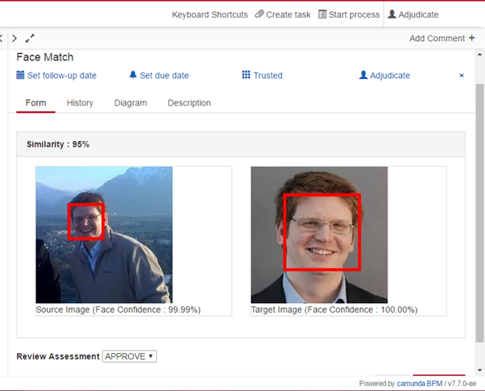

+++
title = "Let's Face it, BPMN and DMN Rock!"
date = "2018-05-16T14:44:10+01:00"
author = "Rob Parker"
draft = true
categories = ["Execution"]
tags = ["AWS", "Rekognition"]
+++

I often describe process based applications as a lot like Lego ®. Functions and services are like the different types and styles of bricks, BPMN process models are the instructions to assemble those bricks into desired models or outcomes. Hence much like the Lego analogy, from a few re-usable services, I can use BPMN processes to assemble a multitude of useful outcomes. With the trend towards public API’s and the ease of access to cloud based services, my Lego kit just got a whole lot larger!

Amazon Web Services (AWS) recently released additional Artificial Intelligence (AI) services into their Platform as a Service (PaaS) offering. One in particular called Rekognition caught my attention. Rekognition includes a set of image processing services including one which has the ability to match faces in a pair of presented images. Thus consider use-cases where a portrait photo renewal process is required. This could arise in the case of an organisation which issues photographic employee Id, or a government body which issues photographic Id for purposes such as driver licences. Hence, given there is a high quality portrait photograph on record, it is easy for a person to periodically renew their portrait. All that’s required is for the person to present their new portrait (e.g. by attending a photographic point). The renewal process can compare the new portrait to the portrait on record. Provided the two portraits match with sufficient similarity, the new portrait can be accepted as the new portrait of record. A sample process outline is shown below;


The service task to call the AWS Rekognition service is relatively straight forward. The service is exposed as an API, and a number of SDKs are provided. As a re-usable service, I considered creating a Camunda connector to call the service however I settled on using the provided java SDK. The SDK abstracts away a lot of integration infrastructure and required code. As I was also aiming for a ‘classless’ deployment, I used groovy script to wrap the java SDK. Hence sample groovy script to make the AWS Rekognition call is shown below;

```groovy
//
// Setup AWS Rekognition credentials...
//
def credentials = new BasicAWSCredentials("YourAWSAccount", "YourAWSPassword")

//
// Setup Rekognition client...
//
def rekognitionClient = AmazonRekognitionClientBuilder
               .standard()
               .withRegion("us-east-1")
               .withCredentials(new AWSStaticCredentialsProvider(credentials))
               .build();
//
// Create the source image from the process variable
//
def source=new Image().withBytes(ByteBuffer.wrap(execution.getVariable("FACE_MATCH_SOURCE_IMAGE")));

//
// Create the target image from the process variable
//
def target=new Image().withBytes(ByteBuffer.wrap(execution.getVariable("FACE_MATCH_TARGET_IMAGE")));

//
// Create the compare faces request. Set threshold to 0.0 so that even non matches return a result.
//
def request = new CompareFacesRequest()
               .withSourceImage(source)
               .withTargetImage(target)
               .withSimilarityThreshold(0.0);

//
// Call operation
//
def compareFacesResult=rekognitionClient.compareFaces(request);

```

I am using Camunda Spin to persist the response as a Json process variable. The response comprises properties such as the confidence that a face was found in each of the source and target images, the degree of similarity between the two faces and additional details such as the bounding boxes of the faces within each respective image. In a typical process scenario, there would be three outcomes. Either the faces definitely match, the faces definitely don’t match or additional human opinion is required to assess the result. To effect this triage, a decision table as per below is used. It’s conceivable that automated process optimisation and AI could monitor the outcome and tune the parameters of the decision table automatically.


The review user task can readily display the two images side by side. For my implementation I used a start event listener and some groovy script to render the bounding boxes from the Rekognition service onto the source and target images. The user task form uses a combination of Bootstrap styling and the Camunda forms SDK to present the result for further adjudication.  A sample form is shown below.



<sub>Portraits courtesy Jakob Freund Camunda.</sub>

The AWS Rekognition service has shown to be particularly easy to use. The service takes care of finding the faces in images including taking appropriate image rotations and translations. In addition, given poor quality images, the service’s matching capability looks quite robust. The combination of re-usable, robust services and the expressive power of BPMN and DMN provides a formidable development combination in today’s age of innovation.

<sub>This is a guest blog post by Rob Parker. Rob is an Enterprise Architect with a passion for process.</sub>

