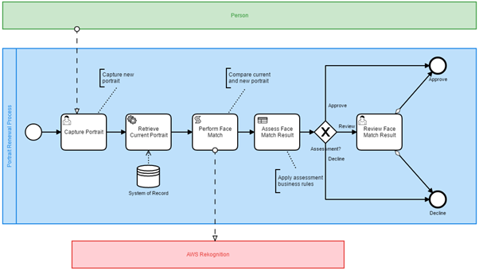
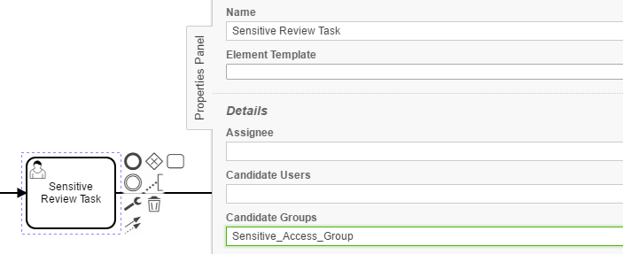
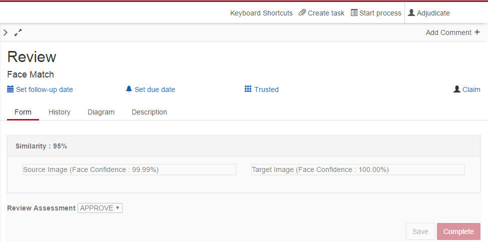
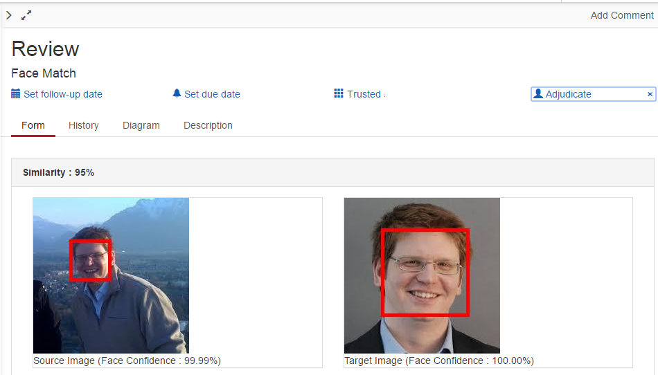

+++ title = "Listen up, keep your privates private!" date = "2018-05-16T14:44:10+01:00" author = "Rob Parker" draft = true categories = ["Execution"] tags = ["Information Security", "Privacy"] +++

In a recent blog post, I described a use case based on facial image recognition to perform an authentication task. In an ideal process, the recognition system either passes or fails the recognition task and the process proceeds via straight through processing to completion. In practice there is a fuzzy boundary between these two outcomes where human judgement via a human task is injected into the process. Now consider the case where say an image of a driver licence is used as a reference image. This image contains particularly sensitive information. Hence if a user is required to access this image, have we taken all reasonable steps to protect this information and provide access on a need to know basis?

Sample process model for context

Confidentiality is a well-known principle of information security. Confidentiality is the ability of a system to prevent sensitive information from reaching the wrong hands whilst restricting access to those authorised to view the information. In Tasklist, we can provide an access control such that only members of an authorised group have access to this review task. This is readily achieved by using the candidate group feature within the process modeller. As per the example below, access to the sensitive task in Tasklist can be restricted to members of an authorised group.

Candidate group assignment

Is this enough, have we taken all reasonable steps to restrict access? This solution still has a weakness in that all members of the authorised group may be able to view the sensitive information via the form preview panel in Tasklist. Thus users within this group may have access to the sensitive data without the system being able to record the access event for audit purposes. Hence what if we introduced a new requirement that all view access to the data must be recorded at the individual level of granularity? There is a way and it relies on scopes, tolerant readers and task listeners.

Camunda uses the concept of variable scopes. Process variables can be process level, execution level or task level scope. Hence in terms of minimising access to and the duration of access to variables, putting variables into say task scope limits their lifetime to the duration of the task.

A task listener can be used to facilitate putting content into task level scope. In this particular instance, I use an assignment listener to facilitate management of sensitive content lifecycle. For example, on the user task assignment event, I could for example decrypt a sensitive payload and put a subset into task level scope for use by the task. If the task is unassigned, I can revoke that content from task scope. If the task is complete, the engine will automatically purge the content from task scope as the scope will no longer exist. 

Within Tasklist, task forms may be previewed with content in the preview pane.  Hence if the sensitive content were available, even as a local task variable, the content may be viewed without owning the task. Whilst the authorisation subsystem may restrict access to these views to a subset of authorised users, there is still no definitive audit trail as to who from this subset may have viewed the sensitive content via the preview pane. By attaching the disclosure of this content to the assignment listener, a definitive audit trail is maintained indicating that this particular user cannot deny having been given the opportunity to view the sensitive content.

Ultimately this mechanism works because the Tasklist forms can be considered tolerant readers. If the content is not available e.g. as task variables in the preview pane prior to assignment, the form render process gracefully runs and just doesn’t render the content.

A screen shot of the task prior to user assignment is shown below. Note that the sensitive images are not visible as the task has not been claimed.

Unassigned Task view

A screen shot of the task after it has been claimed is shown below. Note how the sensitive images are now visible and the task has an assignee.

Assigned Task view

So in summary, the combination of local scope, task listener and authorisation ensure confidentiality of data access by providing audited access to sensitive data on a need to know basis. Whilst this is not the only way to access sensitive content, this technique is assuming that the other access mechanisms such as database, API and cockpit access have adequate controls. The intent of the post is not to be definitive, but to raise awareness as to what’s possible…

This is a guest blog post by Rob Parker. Rob is an Enterprise Architect with a passion for process.
