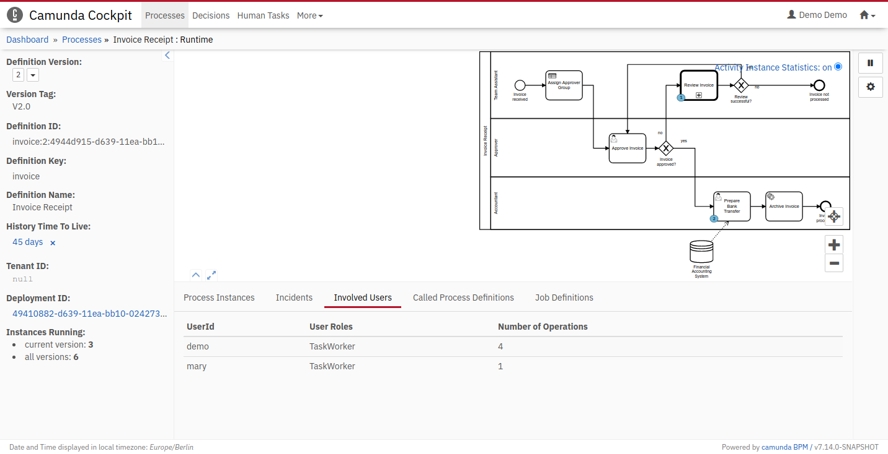

+++
author = "Camunda BPM Team"
categories = ["Execution"]
tags = ["Release Note"]
date = "2020-08-11T09:00:00+00:00"
title = "All New Frontend Plugin System for Cockpit starting with Camunda BPM 7.14"
+++

We are happy to announce, that Camunda BPM 7.14 (scheduled for Tuesday, October 13th, 2020) includes an all new frontend plugin system for Cockpit. It replaces the current AngularJS 1.8 based plugin system and enables you to extend Cockpit with domain-specific information written in the web-technologies of your choice.

<!-- more -->

# What are Plugins
Webapp Plugins are user extensions that provide custom functionality to Cockpit, Tasklist, and Admin, which Camunda does not provide out of the box. It allows you to embed domain-specific information into Camunda tooling without switching applications.  

The new plugin system allows you to use the Javascript framework you are most familiar with, whether it be React, Angular, or just plain Javascript. 

Cockpit is the first webapp to receive a new plugin system. Tasklist and Admin will behave the same as in 7.13.  


# Developing a Plugin
In this step-by-step example, we will guide you through creating a plugin, adding a frontend library (we are using React), and greeting the user on the dashboard. If you want to follow along, make sure you have a modern version of NodeJS and Camunda BPM 7.14.0-alpha2 installed. We will be using the Tomcat distribution for this example. Some paths might be different if you are using another application server. 

## The Interface
Let's have a look at the Plugin API and how to integrate it into Cockpit. Check out this "Hello World" plugin:

```Javascript
// plugin.js

export default {
  id: "myDemoPlugin",
  pluginPoint: "cockpit.dashboard",
  priority: 10,
  render: (node, { CSRFToken }) => {
    node.innerHTML = `Hello World!`;
  }
};
```
Let's go through it line by line:

  * `export default {}`: Is a JavaScript Module which exports an Object. If you have multiple plugins in one file, you can also export an array of Objects.
  *  `id: "involvedUsers"`: The unique ID of our plugin
  *  `pluginPoint: "cockpit.processDefinition.runtime.tab"`: The pluginPoint property describes where the plugin will be rendered. They correspond to the list of Plugin-Points shown in the [docs](https://github.com/camunda/camunda-bpm-webapp/blob/master/ui/cockpit/docs/plugins.md)
  * `priority: 10`: If there are multiple Plugins at the same plugin point, the one with the highest priority will be at the top.
  * `render: (node, { CSRFToken })`: The heart of our plugin, here is where we can extend cockpit. The render function receives two arguments: a DOM node in which we can render our content, and an Object with additional information. What will be passed as additional information depends on the plugin point. On the Dashboard, we only receive the CSRF token, which we will use later to make REST requests.

To register it, save the file in your cockpit scripts folder. On Tomcat, this would be `server/apache-tomcat-{version}/webapps/camunda/app/cockpit/scripts`. Lastly, we register it in the `config.js` by adding it to the customScripts field:

```Javascript
// config.js

export default {
  customScripts: [
    'scripts/plugin.js'
  ]
}
```

Now you can open your browser and log in. If everything worked correctly, it should look something like the picture below. You might have to force-refresh the page to see the results.


If you don't want to add a frontend library, you can stop here and continue developing your plugin using the DOM API. 

## Adding a Frontend Library
To use external libraries in your plugin, you have to provide them with your plugin code in a bundle. We will be using React as a library and Rollup as a bundler for this example.

First, let's create a project and install react.

```shell
npm init -y
npm install --save react react-dom
```

Now we can import and use React in our plugin code. For now, let's create a simple component which receives the CSRF token as a prop: 
```Javascript
// Greetings.js
import React from "react";

function Greetings({ CSRFToken }) {
  return <span>This is rendered in React: {CSRFToken}</span>;
}

export default Greetings;
```

And render it using React into the node in our Plugin:
```Javascript
// plugin.js
import React from "react";
import ReactDOM from "react-dom";

import Greetings from "./Greetings";
let container;

export default {
  // ...,
  render: (node, { CSRFToken }) => {
    container = node;
    ReactDOM.render(
      <Greetings CSRFToken={CSRFToken} />,
      container
    );
  },
  unmount: () => {
    ReactDOM.unmountComponentAtNode(container);
  }
};
```
As you have noticed, we also added an `unmount` function and cached the container instance. While the plugin will work without it, it is good practice to unmount and clean up all your components to avoid memory leaks.


To deploy the react plugin, we will have to bundle it first. For this, we will install rollup and a few plugins so we can transpile the JSX we just wrote:

```
npm install --save-dev rollup \
    @babel/core \
    @babel/preset-react \
    @rollup/plugin-babel \
    @rollup/plugin-commonjs \
    @rollup/plugin-node-resolve \ 
    @rollup/plugin-replace
```

Now we can configure our bundle in the `rollup.config.js`. We will have to transpile JSX using babel, include all external modules, and replace `NODE_ENV` flags. The final configuration looks like this:

```Javascript
import babel from "@rollup/plugin-babel";
import resolve from "@rollup/plugin-node-resolve";
import commonjs from "@rollup/plugin-commonjs";
import replace from "@rollup/plugin-replace";

export default {
  input: "src/plugin.js",
  output: {
    file: "dist/plugin.js"
  },
  plugins: [
    resolve(),
    babel({"presets": ["@babel/preset-react"]}),
    commonjs({
      include: "node_modules/**"
    }),
    replace({
       "process.env.NODE_ENV": JSON.stringify("production")
    })
  ]
};
```

Running `rollup -c` with this configuration will take `plugin.js` located in the `src/` folder and transforms it into a deployable `plugin.js` in the `dist/` folder.

When you deploy it, it should look like this:


## Writing your Plugin

Let's extend the functionality and greet the user by name. To achieve that, we will use react hooks for state management and the fetch API to get the currently logged in user.

```JavaScript
// Greetings.js

import React, { useState, useEffect } from "react";

const base = document.querySelector("base");
const adminApi = base.getAttribute("admin-api");

function Greetings({ CSRFToken }) {
  const [user, setUser] = useState();

  useEffect(() => {
    fetch(adminApi + "auth/user/default", {
      headers: {
        "Accept": "application/json",
        "X-XSRF-TOKEN": CSRFToken,
      },
    }).then(async (res) => {
      setUser(await res.json());
    });
  }, [setUser, CSRFToken]);

  if (!user) {
    return <span>Loading...</span>;
  }
  return <h3>Welcome {user.userId}, have a nice day!</h3>;
}

export default Greetings;
```

As you can see, we use the base tag to get the admin api and the CSRF token we passed as a prop in the request headers.
State management is done with `useState`. You can extend this example with your own React components. For example, you could display all open Tasks that are assigned to the user or build a calendar integration with an external service.
If you want to add custom CSS, you can extend the `user-styles.css` in the webapp folder.



Here are some ideas for you to continue with the development:
  * minify the bundle using uglify
  * add custom CSS in the user-styles
  * try out the other plugin points

You can read about the plugin system in more detail in our [docs](https://github.com/camunda/camunda-bpm-webapp/blob/master/ui/cockpit/docs/plugins.md) or check out the [source code](https://github.com/camunda/camunda-bpm-webapp/tree/master/ui/cockpit). If you get stuck or want to share the cool plugins you have build, head over to our [community forum](https://forum.camunda.org/) and tell us about it.

If you are interested in using other libraries, check out our other [examples](https://github.com/camunda/camunda-bpm-webapp/tree/master/ui/cockpit/customScripts).
